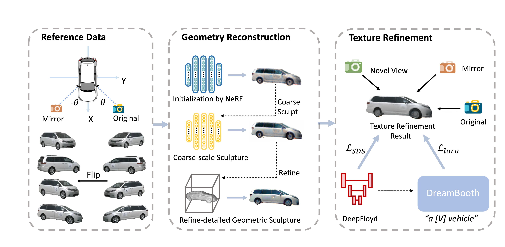

<h2 align="center"> <a href="https://github.com/PKU-YuanGroup/repaint123">DreamCar: Leveraging Car-specific Prior for in-the-wild 3D Car Reconstruction</a></h2>
<h5 align="center"> If you like our project, please give us a star ⭐ on GitHub for latest update.  </h2>

<h5 align="center">

[](https://xiaobiaodu.github.io/dreamcar-project/)
[](https://arxiv.org/abs/2407.16988)
[](https://github.com/xiaobiaodu/DreamCar/blob/master/LICENSE) 


</h5>

## [Project page](https://xiaobiaodu.github.io/dreamcar-project/) | [Paper](https://arxiv.org/abs/2407.16988) 





## 😮 Highlights

DreamCar can reconstruct a completed 3D car model in the moving-forward scene given a few images even a single image.

### 🔥 Symmetry Learning, Car-specific Piror, Pose Optimization 
- Symmetry Learning: We use the symmetric nature of cars to reconstruct a completed 3D car.
- Car generative prior: We contribute a 3D car dataset to empower Zero123 with car-specific piror.
- Pose optimization: We propose a pose optimization method to optimize the poses with error from self-driving datasets.


## 🚩 **Updates**

Welcome to **watch** 👀 this repository for the latest updates.

✅ **[2024.7.23]** : Release [project page](https://xiaobiaodu.github.io/dreamcar-project/).

✅ **[2024.7.23]** : Code Release. 


## Installation
### Install threestudio

**This part is the same as original threestudio. Skip it if you already have installed the environment.**

See [installation.md](docs/installation.md) for additional information, including installation via Docker.

- You must have an NVIDIA graphics card with at least 20GB VRAM and have [CUDA](https://developer.nvidia.com/cuda-downloads) installed.
- Install `Python >= 3.8`.
- (Optional, Recommended) Create a virtual environment:

```sh
python3 -m virtualenv venv
. venv/bin/activate

# Newer pip versions, e.g. pip-23.x, can be much faster than old versions, e.g. pip-20.x.
# For instance, it caches the wheels of git packages to avoid unnecessarily rebuilding them later.
python3 -m pip install --upgrade pip
```

- Install `PyTorch >= 1.12`. We have tested on `torch1.12.1+cu113` and `torch2.0.0+cu118`, but other versions should also work fine.

```sh
# torch1.12.1+cu113
pip install torch==1.12.1+cu113 torchvision==0.13.1+cu113 --extra-index-url https://download.pytorch.org/whl/cu113
# or torch2.0.0+cu118
pip install torch torchvision --index-url https://download.pytorch.org/whl/cu118
```

- (Optional, Recommended) Install ninja to speed up the compilation of CUDA extensions:

```sh
pip install ninja
```

- Install dependencies:

```sh
pip install -r requirements.txt
```

### Download pre-trained models
- **Dreamcar123**. We use our `dreamcar123.ckpt` to provide car-specific piror. You can download it [here](https://huggingface.co/xiaobiaodu/dreamcar123/tree/main) into `load/zero123/`. 
-
- **Omnidata**. We use [Omnidata](https://github.com/EPFL-VILAB/omnidata/tree/main/omnidata_tools/torch) for depth and normal predition in `preprocess_image.py` (copyed from [stable-dreamfusion](https://github.com/ashawkey/stable-dreamfusion)).
```sh
cd load/omnidata
gdown '1Jrh-bRnJEjyMCS7f-WsaFlccfPjJPPHI&confirm=t' # omnidata_dpt_depth_v2.ckpt
gdown '1wNxVO4vVbDEMEpnAi_jwQObf2MFodcBR&confirm=t' # omnidata_dpt_normal_v2.ckpt
```


## Quickstart
- **Memory Usage**. We run the default configs on 80G A100 GPUs.
- We provide the instruction below for the training in a 24G GPU, You can improve the rendering resolution of NeRF and NeuS by 
```data.height=128 data.width=128 data.random_camera.height=128 data.random_camera.width=128``` and  the rendering resolution of Texutering stage by
```data.height=1024 data.width=1024 data.random_camera.height=1024 data.random_camera.width=1024```to get better results. 


``` shell


export image_path="example_data/94b33ce331b844dcb991a2020742cebf"
id=$(basename "$image_path")
export CUDA_VISIBLE_DEVICES=0
python preprocess_image.py  "$image_path"

## stage 1 NeRF
python launch.py   --train   \
   --config configs/dreamcar-coarse-nerf-nuscenes.yaml data.image_path="$image_path"      \
      data.random_camera.height=64 data.random_camera.width=64   data.height=64  data.width=64  \
   system.guidance_3d.pretrained_model_name_or_path="load/zero123/dreamcar123.ckpt"   


## stage 1 Neus
ckpt=outputs/dreamcar-coarse-nerf/"$id"/ckpts/last.ckpt
python launch.py  --train  \
    --config configs/dreamcar-coarse-neus-nuscenes.yaml  \
    system.weights="$ckpt" data.image_path="$image_path"   \
      data.random_camera.height=64 data.random_camera.width=64   data.height=64  data.width=64  \
      system.guidance_3d.pretrained_model_name_or_path="load/zero123/dreamcar123.ckpt"


## stage 2 Geo
ckpt=outputs/dreamcar-coarse-neus/"$id"/ckpts/last.ckpt
python launch.py  --train  \
  --config configs/dreamcar-geometry-nuscenes.yaml \
  system.geometry_convert_from="$ckpt"  data.image_path="$image_path"  \
    system.guidance_3d.pretrained_model_name_or_path="load/zero123/dreamcar123.ckpt"


## stage 3 Tex
ckpt=outputs/dreamcar-geometry/"$id"/ckpts/last.ckpt
python launch.py --train  --config configs/dreamcar-texture-nuscenes.yaml \
      data.image_path="$image_path" system.geometry_convert_from="$ckpt" \
            data.random_camera.height=128 data.random_camera.width=128   data.height=128  data.width=128  \
        system.guidance_3d.pretrained_model_name_or_path="load/zero123/dreamcar123.ckpt"
 
 
```


## 👍 **Acknowledgement**
This work is built on many amazing research works and open-source projects, thanks a lot to all the authors for sharing!
* [Threestudio](https://github.com/threestudio-project/threestudio)
* [Zero123](https://github.com/cvlab-columbia/zero123)


## ✏️ Citation

If you find our paper and code useful in your research, please consider giving a star :star: and citation :pencil:.


```BibTeX

@misc{du2024dreamcarleveragingcarspecificprior,
      title={DreamCar: Leveraging Car-specific Prior for in-the-wild 3D Car Reconstruction}, 
      author={Xiaobiao Du and Haiyang Sun and Ming Lu and Tianqing Zhu and Xin Yu},
      year={2024},
      eprint={2407.16988},
      archivePrefix={arXiv},
      primaryClass={cs.CV},
      url={https://arxiv.org/abs/2407.16988}, 
}